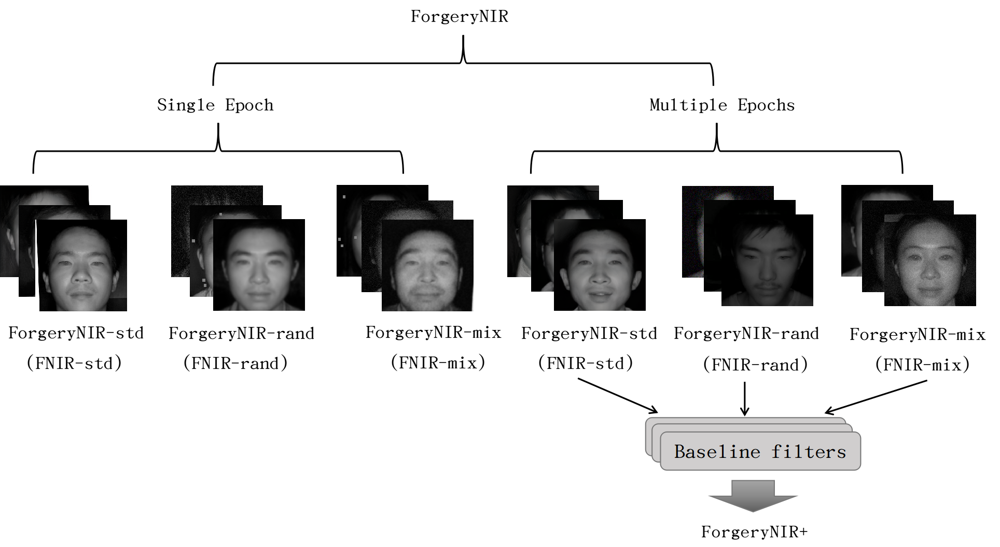
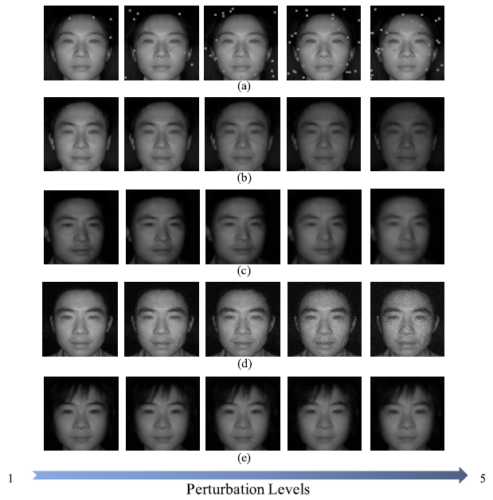

# ForgeryNIR: Deep Face Forgery and Detection in Near-Infrared Scenario

This repository provides the dataset and code for the following paper:

---
> **Abstract:** 
Deep face forgery and detection is an emerging topic due to the development of GANs. Face forgery detection relies greatly on existing databases for evaluation and adequate training examples for data-hungry machine learning algorithms. However, considering the wide application of face recognition in near-infrared scenarios, there is no publicly available face forgery database that includes near-infrared modality currently. In this paper, we present an attempt at constructing a large-scale dataset for face forgery detection in the near-infrared modality and propose a new forgery detection method based on knowledge distillation named cross-modality knowledge distillation aiming to use a teacher model which is pre-trained on the visible light-based (VIS) big data to guide the student model with a small amount of near-infrared (NIR) data. The proposed near-infrared face forgery dataset, named ForgeryNIR, contains a total of over 50,000 real and fake identities. A number of perturbations are applied to help simulate real-world scenarios. All source images in ForgeryNIR are collected from CASIA NIR-VIS 2.0, and fake images are generated via multiple GAN techniques. The proposed dataset fills the gap of face forgery detection research in the near-infrared modality. A comprehensive study on six representative detection baselines is conducted to evaluate the performance of face forgery detection algorithms in the NIR domain. We further construct a hard testing set, named ForgeryNIR+, which contains forged images that have bypassed existing face forgery detection methods. The proposed datasets will be publicly available and aim to help boost further research on face forgery detection, as well as NIR face detection and recognition.

## Dataset

ForgeryNIR dataset will be published soon.
Several face manipulation results:

  

Example images selected from ForgeryNIR, real images are collected in (a) CASIA NIR-VIS 2.0 and forgery images are generated by four types of GANs: (b) CycleGAN, (c) PorGAN, (d) StyleGAN, (e) StyleGAN2.

## Download

|       Dataset name       |         Download         |Generate method|      Deepfake images     |           Actors           |
   |--------------------------|--------------------------|----|--------------------------|----------------------------|
   |   **ForgeryNIR**   |[**download (4md6)**](https://pan.baidu.com/s/1rCiiX1lIhOuqApEndrY1rQ)|**GANs**|**50000**|**-**|

**File Structure**:
~~~
ForgeryNIR
                    
                    |--ForgeryNIR-std
                                 |--0_real
                                 |--cyclegan
                                 |--progan
                                 |--stylegan
                                 |--stylegan2      
                    |--ForgeryNIR-rand
                                 |--0_real
                                 |--cyclegan
                                 |--progan
                                 |--stylegan
                                 |--stylegan2
                    |--ForgeryNIR-mix
                                 |--0_real
                                 |--cyclegan
                                 |--progan
                                 |--stylegan
                                 |--stylegan2

ForgeryNIR+ 
                   |--0_real
                   |--cyclegan
                   |--progan
                   |--stylegan
                   |--stylegan2
~~~

## Summary

### Data Collection

CASIA NIR-VIS 2.0  is a dataset proposed for NIR-VIS recognition including 725 identities with 17,580 face images. and the ages of the identities are very wide, from children to old people. the faces in the near-infrared modality are selected as our face generation training source data.

### Forged Face Generation

	

### Face Augumentation
We carefully apply five types of perturbations to manipulate the fake images at five intensity levels, leading to 25 perturbations in total to mimic real-world image processing and transmission situations.

	

### Baselines

We select six representative forgery detection baselines([CNNDetection](https://arxiv.org/abs/1912.11035), [GANFingerprint](https://arxiv.org/pdf/1811.08180.pdf), [GANDCTAnalysis](https://arxiv.org/abs/2003.08685), [Wavelet-packet](https://arxiv.org/abs/2106.09369), [Xception](https://openaccess.thecvf.com/content_CVPRW_2020/papers/w39/Hulzebosch_Detecting_CNN-Generated_Facial_Images_in_Real-World_Scenarios_CVPRW_2020_paper.pdf), [MLP](https://openaccess.thecvf.com/content/CVPR2021/papers/Chandrasegaran_A_Closer_Look_at_Fourier_Spectrum_Discrepancies_for_CNN-Generated_Images_CVPR_2021_paper.pdf)) using the ForgeryNIR dataset. Please refer to our paper for more information.

## Citation

@article{wang2022forgerynir,
  title={ForgeryNIR: Deep Face Forgery and Detection in Near-Infrared Scenario},
  
  author={Wang, Yukai and Peng, Chunlei and Liu, Decheng and Wang, Nannan and Gao, Xinbo},
  
  journal={IEEE Transactions on Information Forensics and Security},
  
  year={2022},
  
  publisher={IEEE}
}

